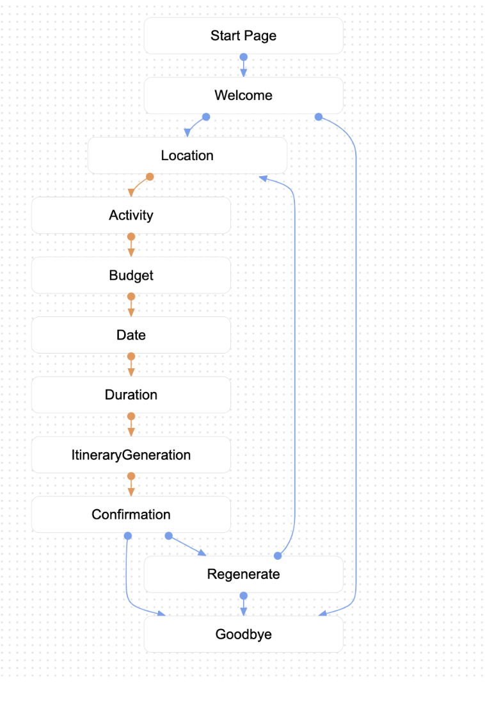

# 🚀 AI-Powered Itinerary Planning Chatbot

**Project by:** Christian Quach | Data Science & Automation Consultant | Mentoring Project  

---

## **📌 Project Overview**  
This project developed an **AI-powered chatbot** for **Tourism Australia**, serving as a **virtual travel companion** that helps tourists create **personalized itineraries** based on their preferences, such as location, activities, budget, dates, and duration.  

Built using **Dialogflow CX**, the chatbot follows a **modular conversation flow** to capture user inputs through **parameter extraction and entity recognition**. It leverages **Vertex AI** to dynamically generate **customized travel plans**, ensuring a seamless and tailored experience for users. 

---

## **💡 Thought Process Behind the Chatbot Design**

### **User Experience Focus**
- Designed to create a **seamless, engaging, and interactive experience** for tourists.
- Captures user inputs effectively and **generates a tailored itinerary dynamically**.

### **Modular Structure**
- Uses structured conversation pages to ensure **scalability and easy management**.
- Pages: **Welcome, Location, Activity, Budget, Date, Duration, GenerateItinerary, Confirmation, Regenerate, and Goodbye**.

### **Parameter Handling**
- Each page is focused on capturing a specific **travel preference** (location, activities, budget, date, duration).
- Parameters are **stored and used later** to generate a **customized itinerary**.

### **Flexibility & Iteration**
- Users can **refine their itinerary** through the **Confirmation and Regenerate** pages.
- If users are unsatisfied, they can **easily regenerate a new itinerary**.

---

## **🗺️ Conversation Flow & Design**

### **1️⃣ Welcome Page**  
**Bot:** "Welcome to your personal travel assistant! Would you like to create a customized itinerary?"
- **User Response Options:**
  - Yes → Directs to **Location Page**
  - No → Directs to **Goodbye Page**

### **2️⃣ Location Page**  
**Bot:** "Great! Which location would you like to visit?"
- **Parameter:** `location`
- **Entity:** Custom entity capturing popular travel destinations.
- **Next Step:** Moves to **Activity Page**.

### **3️⃣ Activity Page**  
**Bot:** "What activities are you interested in during your trip?"
- **Parameter:** `activity`
- **Entity:** Custom entity listing activities (e.g., hiking, sightseeing, dining).
- **Next Step:** Moves to **Budget Page**.

### **4️⃣ Budget Page**  
**Bot:** "What’s your budget level for this trip?"
- **Parameter:** `budget`
- **Entity:** Predefined entity (e.g., low, medium, high).
- **Next Step:** Moves to **Date Page**.

### **5️⃣ Date Page**  
**Bot:** "When do you want your trip to start? Please provide a date."
- **Parameter:** `start_date`
- **Entity:** System entity `sys.date`
- **Next Step:** Moves to **Duration Page**.

### **6️⃣ Duration Page**  
**Bot:** "How long do you plan to stay? (e.g., 3 days, 1 week)"
- **Parameter:** `duration`
- **Entity:** Custom entity for capturing duration.
- **Next Step:** Moves to **GenerateItinerary Page**.

### **7️⃣ GenerateItinerary Page**  
- **Action:** Calls **Vertex AI API** to generate a **personalized travel plan**.
- **Uses Collected Parameters:** `location`, `activity`, `budget`, `start_date`, `duration`.
- **Next Step:** Moves to **Confirmation Page**.

### **8️⃣ Confirmation Page**  
**Bot:** "Here’s your personalized itinerary. Are you happy with it?"
- **User Response Options:**
  - Yes → Moves to **Goodbye Page**
  - No → Moves to **Regenerate Page**

### **9️⃣ Regenerate Page**  
**Bot:** "Would you like to regenerate your itinerary based on new preferences?"
- **User Response Options:**
  - Yes → Resets all parameters to null and redirects back to **Location Page**
  - No → Moves to **Goodbye Page**
- **Action:** Resets parameters if "Yes" is selected.

### **🔟 Goodbye Page**  
**Bot:** "Thank you for using our travel assistant! Have a great trip!"
- **End of Flow:** Conversation ends.

---

## **🔍 Key Features & Technologies**

- **AI & ML:** Dialogflow CX, Vertex AI
---

## **📸 Project Demo & Screenshots**
📽️ **Demo Video:** [Link](https://latrobeuni-my.sharepoint.com/personal/22008309_students_ltu_edu_au/_layouts/15/stream.aspx?id=%2Fpersonal%2F22008309%5Fstudents%5Fltu%5Fedu%5Fau%2FDocuments%2FChatbot%20Demonstration%2Emov&nav=eyJyZWZlcnJhbEluZm8iOnsicmVmZXJyYWxBcHAiOiJTdHJlYW1XZWJBcHAiLCJyZWZlcnJhbFZpZXciOiJTaGFyZURpYWxvZy1MaW5rIiwicmVmZXJyYWxBcHBQbGF0Zm9ybSI6IldlYiIsInJlZmVycmFsTW9kZSI6InZpZXcifX0&ga=1&referrer=StreamWebApp%2EWeb&referrerScenario=AddressBarCopied%2Eview%2E161b9ba0%2D3a49%2D4b44%2D9c65%2Da8c20123d86f)  
📊 **Architecture Diagram:**  
  

---

## **📜 How to Run Locally**
1. Clone this repository:  
   ```bash
   git clone https://github.com/yourusername/tourism-australia-chatbot.git
   cd tourism-australia-chatbot
   ```
2. Install dependencies:  
   ```bash
   pip install -r requirements.txt
   ```
3. Run the chatbot locally:  
   ```bash
   python chatbot_code.py
   ```
4. Test with sample inputs:  
   ```bash
   python test_chatbot.py
   ```

---

## **📌 Future Enhancements**
- 🏨 **Integrate Hotel & Flight APIs** for real-time travel bookings.
- 🌍 **Multi-language Support** to cater to international travelers.
- 🗺️ **Interactive Map Integration** using Google Maps API.

